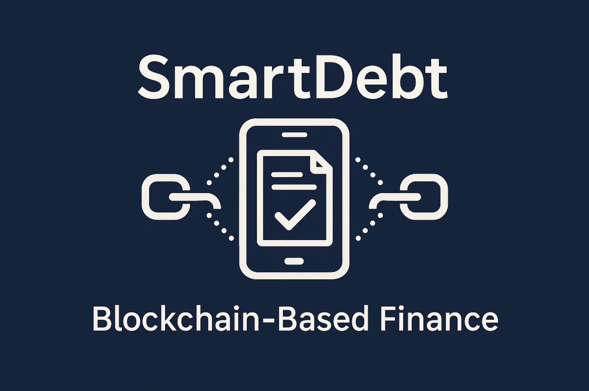
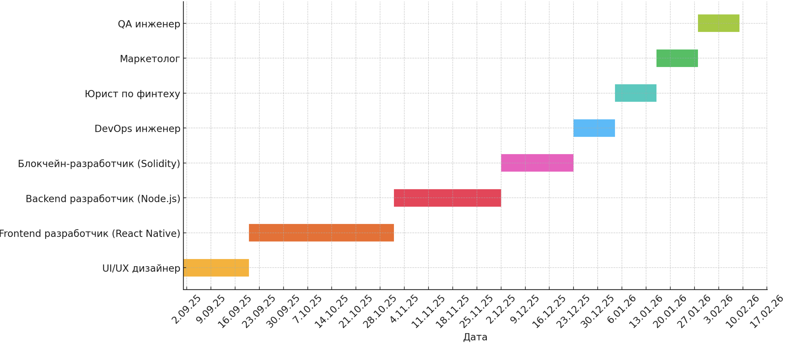

# SmartDebt

## Цифровое доверие. Без посредников. На блокчейне.

SmartDebt — это мобильное приложение на основе технологии блокчейна, которое регулирует заемно-долговые обязательства с помощью децентрализованного хранения данных и смарт-контрактов.

## Идея проекта

Проект направлен на цифровизацию долговых отношений между физическими лицами. Сервис помогает безопасно фиксировать условия займа, контролировать выполнение обязательств и автоматизировать взаимодействие сторон.

## Основные преимущества

- прозрачность условий займа
- фиксация данных в блокчейне
- автоматическое исполнение обязательств
- снижение зависимости от бумажных договоров
- уменьшение транзакционных издержек

## Дорожная карта проекта

