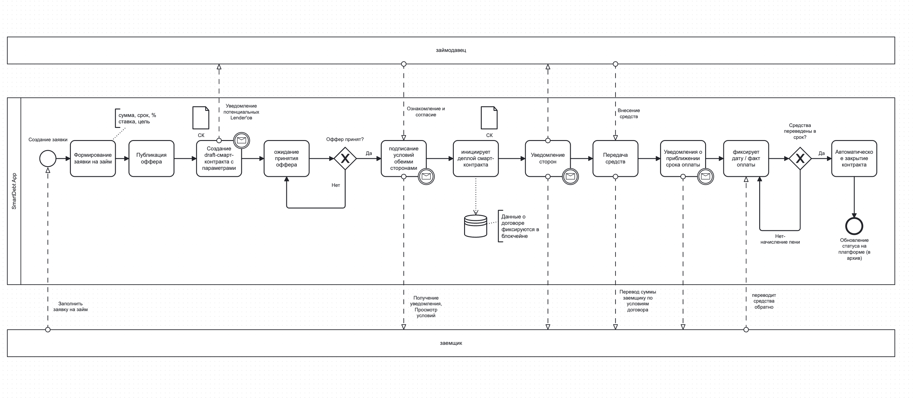
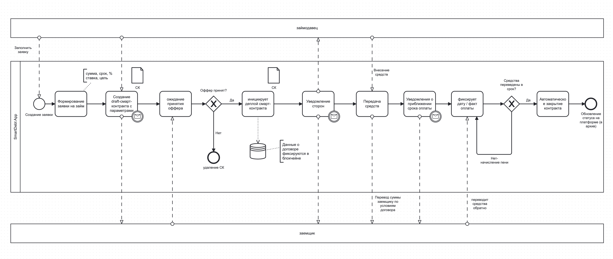
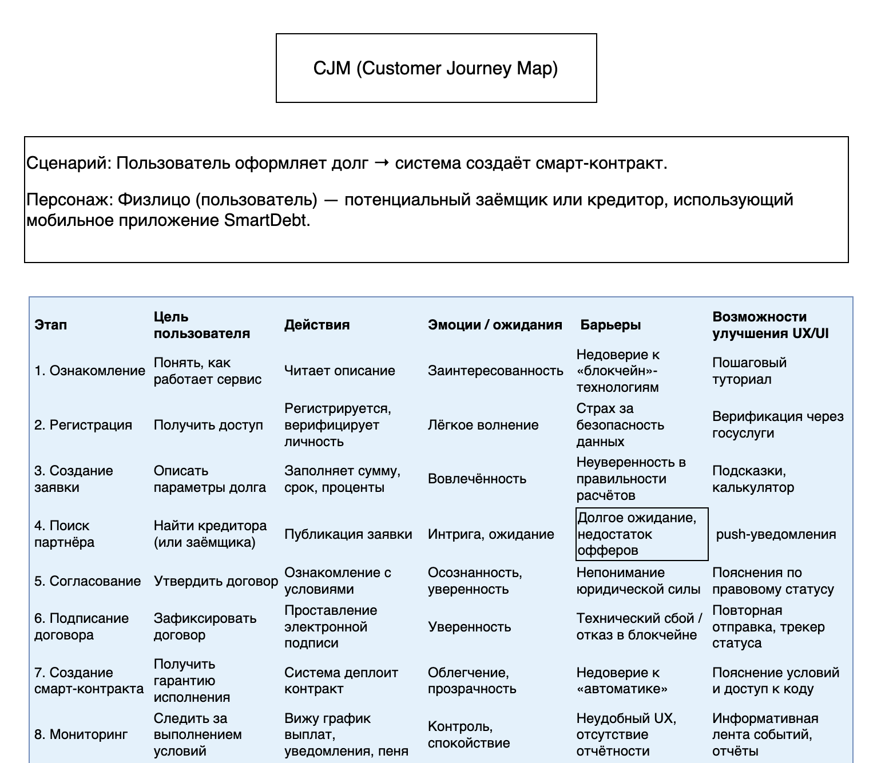
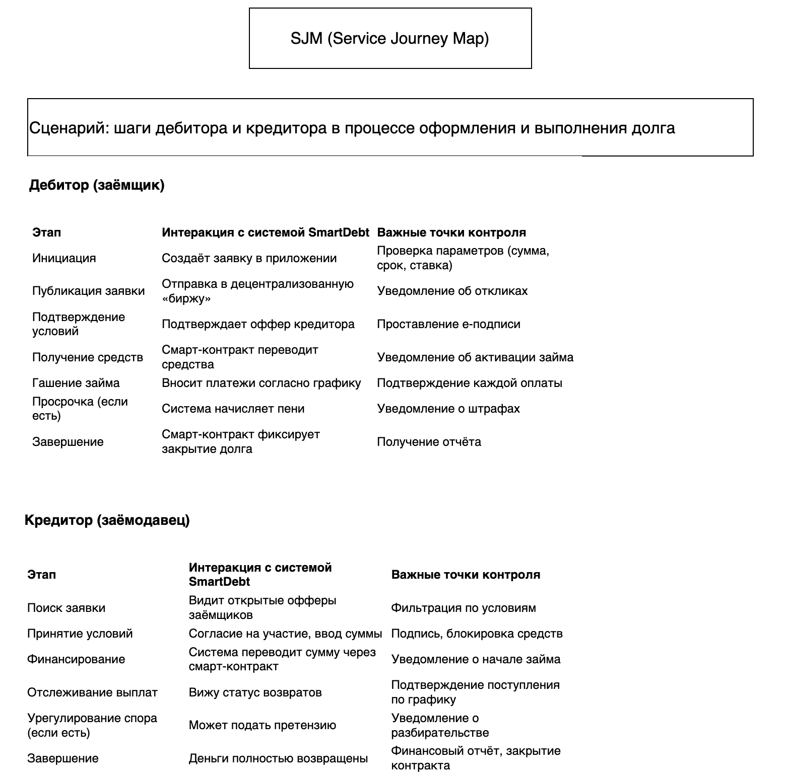

# О проекте SmartDebt

SmartDebt — это финтех-приложение, которое объединяет блокчейн, логику смарт-контрактов и мобильный интерфейс для безопасного управления долговыми обязательствами.

## Проблема

Многие долговые и подрядные договорённости остаются устными или фиксируются только в переписках. Это создаёт риски:

- споров по срокам и суммам
- отсутствия доказательной базы
- невозврата средств
- недоверия между сторонами

## Решение

SmartDebt переводит обязательства в цифровой формат, где условия фиксируются в смарт-контракте, а ключевые этапы сделки становятся прозрачными и контролируемыми.

## Целевая аудитория

- физические лица
- самозанятые
- ИП
- небольшие подрядчики
- участники P2P- и B2B-договорённостей

## To Be-процессы

### Сценарий: заемщик → займодавец

### Сценарий: займодавец → заемщик

## Пользовательский путь

### Customer Journey Map

### Service Journey Map

