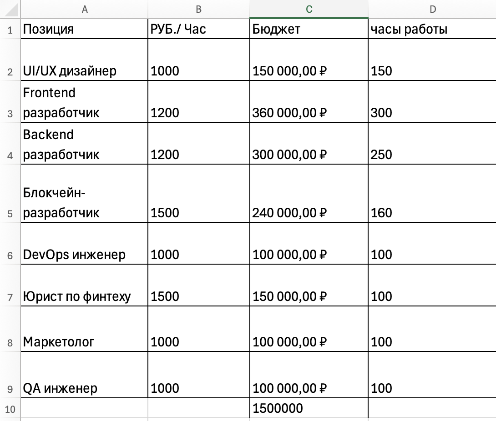
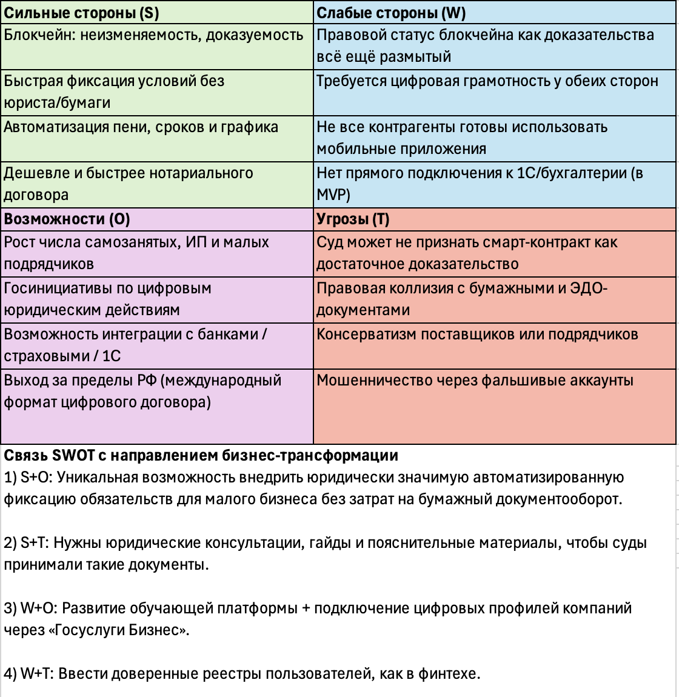
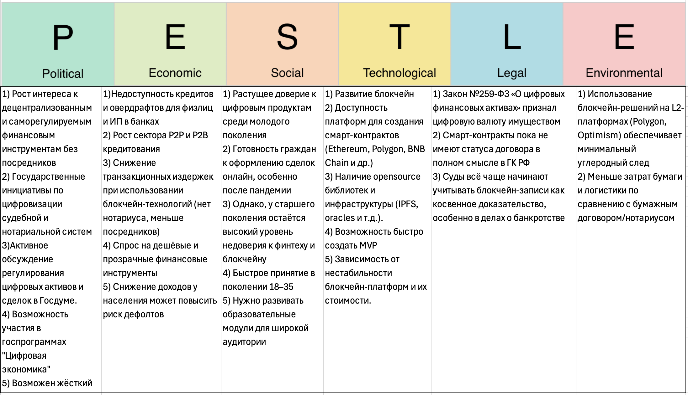

# Исследование и аналитика проекта

SmartDebt проработан как продукт с пользовательской, исследовательской и экономической логикой.

## Экономика проекта

### Смета

Проект рассчитан как MVP с командой из ключевых специалистов: UI/UX-дизайнер, frontend-разработчик, backend-разработчик, blockchain-разработчик, DevOps-инженер, юрист по финтеху, маркетолог и QA.

## SWOT-анализ

### Выводы по SWOT

**Сильные стороны**
- неизменяемость и доказуемость данных
- автоматизация условий займа
- снижение бумажной нагрузки
- более быстрый и дешёвый формат фиксации обязательств

**Слабые стороны**
- правовая неопределённость
- необходимость цифровой грамотности пользователей
- ограниченность MVP
- осторожность части аудитории

## PESTLE-анализ

### Выводы по PESTLE

- **Political:** интерес к цифровизации создаёт окно возможностей
- **Economic:** спрос на дешёвые и прозрачные финансовые инструменты растёт
- **Social:** молодая аудитория лучше воспринимает fintech и цифровые сервисы
- **Technological:** блокчейн-платформы позволяют быстро создавать MVP
- **Legal:** правовая база ещё формируется, но уже создаёт предпосылки для развития
- **Environmental:** цифровой формат уменьшает бумажные и логистические издержки

## Общий вывод

SmartDebt — это проект на стыке fintech, legaltech и blockchain, который отвечает на реальную проблему и имеет потенциал как цифровой сервис фиксации обязательств между людьми и малым бизнесом.
